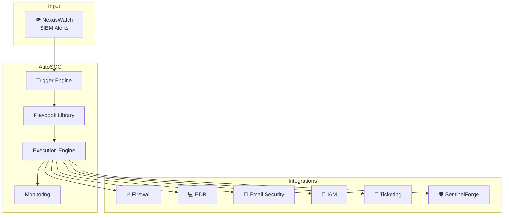
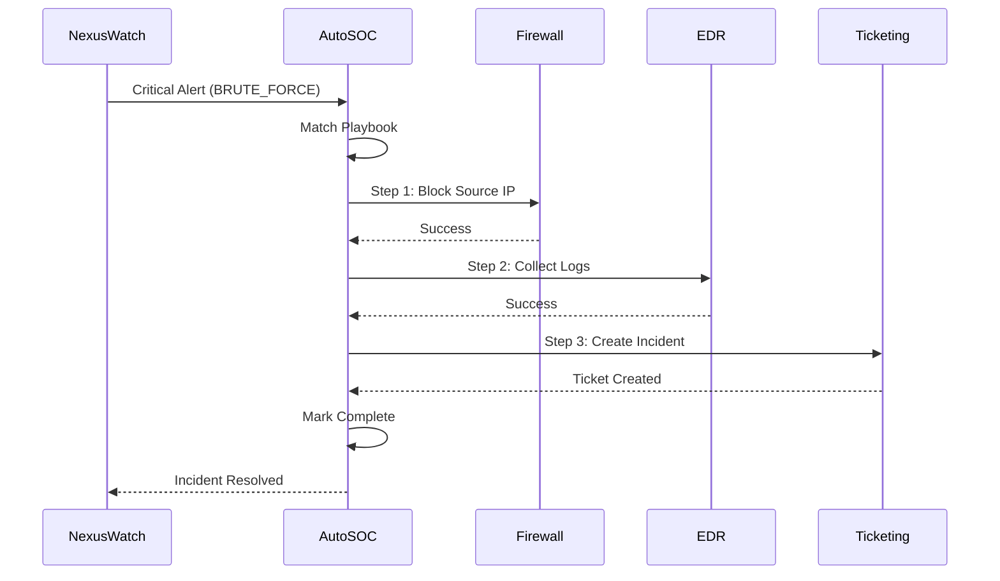

<p align="center">
  
</p>

<p align="center">
  <h1 align="center">⚡ AUTOSOC</h1>
  <p align="center">
    <em>Automate Response. Accelerate Resolution. Always On.</em>
  </p>
</p>

<p align="center">
  
  
  
</p>

<p align="center">
  <em>Built with the tools and technologies:</em>
</p>

<p align="center">
  
  
  
  
  
</p>

---

## 📖 Overview

AutoSOC is the Incident Response Orchestrator component of the SecOps Command Center - an automated platform that executes predefined playbooks to contain, investigate, and remediate security threats. It receives alerts from NexusWatch SIEM and coordinates response actions across your security infrastructure.

## ✨ Features

- **Automated Playbooks** - Pre-built response workflows for common incidents
- **Real-Time Orchestration** - Live incident tracking with step-by-step progress
- **Multi-Action Support** - Firewall, EDR, Email, IAM, Ticketing integrations
- **Incident Control** - Pause/Resume/Abort/Retry/Escalate actions
- **Live Metrics** - Running, completed, failed counts with success rates
- **Playbook Management** - Enable/disable playbooks on the fly

## 🏗️ Architecture



## 📊 Playbook Flow



## 📋 Pre-Built Playbooks

| Playbook | Trigger | Steps | Avg Time |
|----------|---------|-------|----------|
| **Brute Force Response** | `BRUTE_FORCE` | Block → Enrich → Forensics → Alert → Ticket | 2m 34s |
| **Malware Containment** | `MALWARE_DETECTED` | Isolate → Kill → MemDump → Scan → Quarantine | 8m 12s |
| **Data Exfiltration** | `DATA_EXFILTRATION` | Block → Kill Conn → PCAP → DLP → Legal Hold | 12m 45s |
| **C2 Communication** | `C2_COMMUNICATION` | Sinkhole → Isolate → Hunt → Update Intel | 15m 22s |
| **Phishing Response** | `PHISHING_DETECTED` | Quarantine → Extract IOCs → Block → Search | 5m 18s |
| **Privilege Escalation** | `PRIVILEGE_ESCALATION` | Disable → Revoke → Audit → Hunt Lateral | 6m 42s |

## 🛠️ Tech Stack

| Component | Technology | Purpose |
|-----------|------------|---------|
| Frontend | React 18 | Dashboard UI |
| Build Tool | Vite 5 | Fast development |
| Styling | Inline CSS | Industrial aesthetic |
| Fonts | Rajdhani, IBM Plex Mono | Tech/automation feel |
| Logo | ReportLab | PDF vector graphics |

## 📁 Project Structure

```
autosoc/
├── src/
│   ├── App.jsx              # Main orchestrator dashboard
│   └── main.jsx             # React entry point
├── public/
│   ├── autosoc-logo.png     # Square logo
│   └── autosoc-banner.png   # Wide banner
├── scripts/
│   └── generate_logo.py     # Logo generator
├── index.html               # HTML template
├── package.json             # Dependencies
├── vite.config.js           # Vite configuration
└── README.md
```

## 🚀 Quick Start

### Prerequisites

- Node.js 18+
- npm or yarn

### Installation

```bash
# Clone the repository
git clone https://github.com/yourusername/autosoc.git
cd autosoc

# Install dependencies
npm install

# Start development server
npm run dev
```

Dashboard available at `http://localhost:3002`

### Production Build

```bash
npm run build
npm run preview
```

## 🐳 Docker Deployment

```dockerfile
FROM node:18-alpine AS builder
WORKDIR /app
COPY package*.json ./
RUN npm ci
COPY . .
RUN npm run build

FROM nginx:alpine
COPY --from=builder /app/dist /usr/share/nginx/html
EXPOSE 80
CMD ["nginx", "-g", "daemon off;"]
```

```bash
docker build -t autosoc:latest .
docker run -d -p 3002:80 autosoc:latest
```

## ⚙️ Available Actions

| Action | Description | Integration |
|--------|-------------|-------------|
| `firewall_block` | Block IP at perimeter | Firewall API |
| `edr_isolate` | Isolate endpoint | EDR API |
| `edr_kill_process` | Terminate process | EDR API |
| `sentinelforge_lookup` | Enrich with threat intel | SentinelForge |
| `collect_logs` | Gather forensic logs | SIEM/Log API |
| `email_quarantine` | Remove malicious email | Email API |
| `dns_sinkhole` | Redirect malicious domain | DNS/Firewall |
| `password_reset` | Force credential reset | IAM API |
| `disable_account` | Disable user account | IAM API |
| `create_incident` | Create ticket | Jira/ServiceNow |
| `escalate` | Route to higher tier | Workflow |

## ⌨️ Keyboard Shortcuts

| Key | Action |
|-----|--------|
| `Ctrl+L` | Toggle live mode on/off |
| `Escape` | Close modal |

## 🔒 Security Considerations

- Store integration credentials in secure vault
- Use service accounts with minimal permissions
- Audit all playbook executions
- Implement approval workflows for destructive actions
- Test playbooks in isolated environment first

## 🗺️ SecOps Command Center Roadmap

| # | Component | Status | Description |
|---|-----------|--------|-------------|
| 1 | HoneyTrap | ✅ Complete | Distributed honeypot network |
| 2 | SentinelForge | ✅ Complete | Threat intelligence aggregator |
| 3 | NexusWatch | ✅ Complete | SIEM Dashboard |
| 4 | **AutoSOC** | ✅ Complete | Incident Response Orchestrator |
| 5 | Compliance Engine | 🔜 Planned | Regulatory adherence tracking |

## 🤝 Contributing

1. Fork the repository
2. Create your feature branch (`git checkout -b feature/amazing-feature`)
3. Commit your changes (`git commit -m 'Add amazing feature'`)
4. Push to the branch (`git push origin feature/amazing-feature`)
5. Open a Pull Request

## 📄 License

This project is licensed under the MIT License - see the [LICENSE](LICENSE) file for details.

---

<p align="center">
  <strong>Part of the SecOps Command Center</strong><br>
  🍯 HoneyTrap • 🛡️ SentinelForge • 👁️ NexusWatch • ⚡ AutoSOC
</p>
<p align="center">
  
</p>
