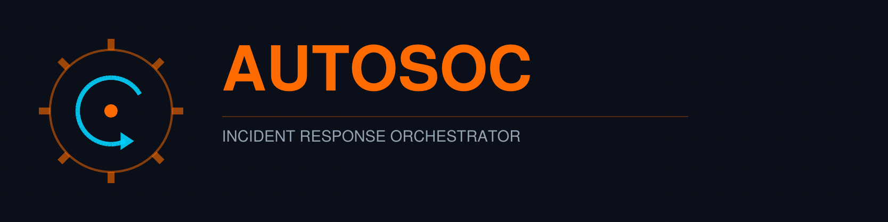
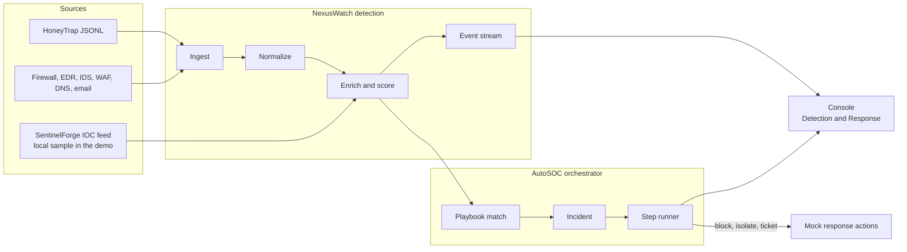
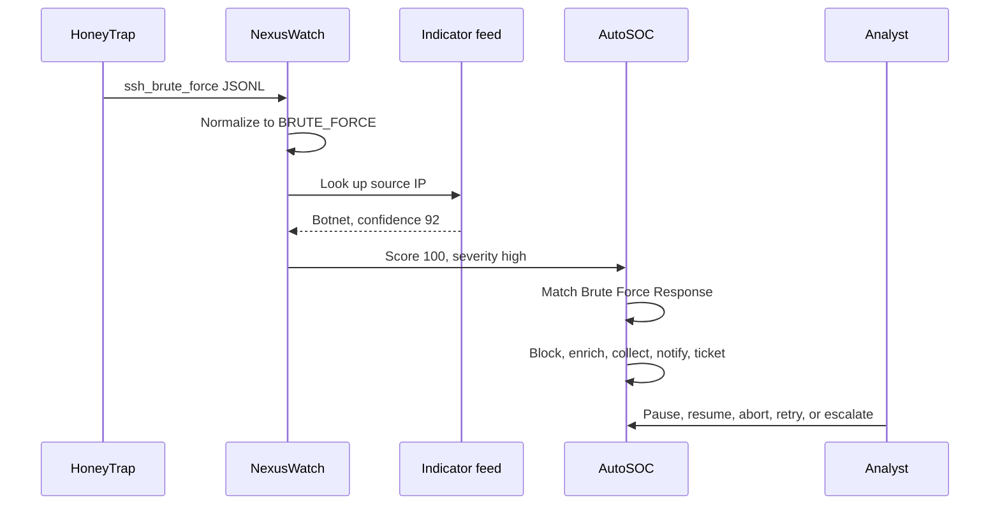
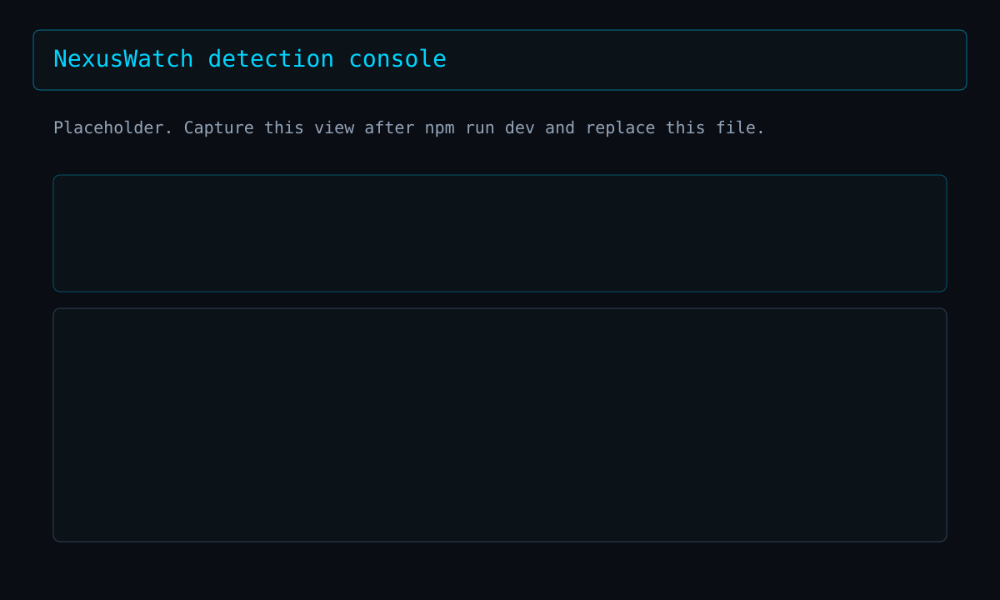
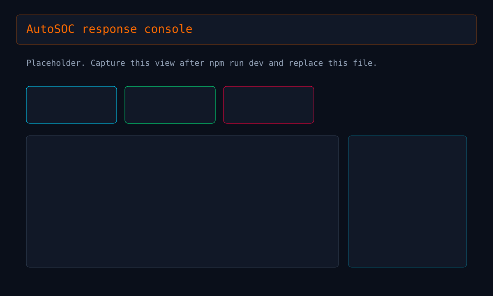

<p align="center">
  
</p>

<h1 align="center">AutoSOC</h1>

<p align="center">
  <em>Automate response. Accelerate resolution. Always on.</em><br>
  Incident response orchestrator for the SecOps Command Center, with NexusWatch detection built in.
</p>

<p align="center">
  
  
  
</p>

NexusWatch, the SIEM dashboard from [lloredia/nexuswatch](https://github.com/lloredia/nexuswatch), is consolidated into this repository. That repository was not modified. Its history is preserved here as the second parent of the merge commit, at source revision `ca0b57b1e52e2a999003ad4b3e4a953768791a77`.

## What AutoSOC does

AutoSOC is a local security-operations console with two jobs:

1. **Detection (NexusWatch).** Ingest HoneyTrap-style events and normalized SIEM alerts, score them, and match them against a local indicator feed that stands in for SentinelForge.
2. **Response (AutoSOC).** When an alert matches an enabled playbook, open an incident and walk the response steps. Analysts can pause, resume, abort, retry, and escalate.

The original NexusWatch UI watched a random event stream. The original AutoSOC UI watched a random incident stream. They now share one in-memory pipeline, so a detection on the SIEM board is the same object the orchestrator responds to.

## Architecture


```mermaid
flowchart LR
  subgraph sources [Sources]
    HT[HoneyTrap JSONL]
    SIEM[Firewall, EDR, IDS, WAF, DNS, email]
    IOC[SentinelForge IOC feed<br/>local sample in the demo]
  end

  subgraph detect [NexusWatch detection]
    ING[Ingest]
    NORM[Normalize]
    ENR[Enrich and score]
    STREAM[Event stream]
  end

  subgraph respond [AutoSOC orchestrator]
    MATCH[Playbook match]
    INC[Incident]
    EXEC[Step runner]
  end

  UI[Console<br/>Detection and Response]

  HT --> ING
  SIEM --> ING
  ING --> NORM --> ENR
  IOC --> ENR
  ENR --> STREAM --> UI
  ENR --> MATCH --> INC --> EXEC --> UI
  EXEC -->|block, isolate, ticket| ACT[Mock response actions]
```


```mermaid
sequenceDiagram
  participant HT as HoneyTrap
  participant NW as NexusWatch
  participant SF as Indicator feed
  participant AS as AutoSOC
  participant AN as Analyst

  HT->>NW: ssh_brute_force JSONL
  NW->>NW: Normalize to BRUTE_FORCE
  NW->>SF: Look up source IP
  SF-->>NW: Botnet, confidence 92
  NW->>AS: Score 100, severity high
  AS->>AS: Match Brute Force Response
  AS->>AS: Block, enrich, collect, notify, ticket
  AN->>AS: Pause, resume, abort, retry, or escalate
```

## Features

- NexusWatch event stream with severity filters, search, 24-hour timeline, attack-origin rollup, and data-source health
- Indicator matching and the original bridge threat-score rules, including severity upgrades above confidence 80
- Six response playbooks: brute force, malware containment, data exfiltration, command-and-control, phishing, and privilege escalation
- Phishing stays disabled until an analyst turns it on. Alerts with no playbook stay on the detection board until someone investigates
- Incident controls: pause, resume, abort, retry, escalate
- Live demo clock that advances running playbooks and replays the sample catalog
- Optional Python bridge for tailing a real HoneyTrap spool into `POST /api/events`

## Quick start

Requirements: Node.js 22 or newer. Node.js 24 is the current LTS and the version used in CI and the container image.

```bash
git clone https://github.com/lloredia/AutoSOC.git
cd AutoSOC
npm install
npm run dev
```

Open http://localhost:8080. The API listens on http://localhost:8787. The Vite dev server proxies `/api` to it.

Production-style local run, one process:

```bash
npm run build
npm start
```

Then open http://localhost:8787.

Container:

```bash
docker compose up --build
```

The image serves the built console and the API on port 8787. Sample alerts are baked in, so no external HoneyTrap or SentinelForge service is required.

## Configuration

Copy `.env.example` to `.env` to override defaults. The server reads `.env` without overriding variables that are already set. Do not commit `.env`.

| Variable               | Default                    | Purpose                                                    |
| ---------------------- | -------------------------- | ---------------------------------------------------------- |
| `PORT`                 | `8787`                     | API and production UI port                                 |
| `HOST`                 | `0.0.0.0`                  | Bind address                                               |
| `DEMO_MODE`            | `true`                     | Advance playbooks and replay samples while live mode is on |
| `LIVE_INTERVAL_MS`     | `3000`                     | Demo tick interval                                         |
| `SAMPLE_EVENTS_PATH`   | `data/sample-events.jsonl` | HoneyTrap and SIEM fixtures                                |
| `SAMPLE_IOCS_PATH`     | `data/sample-iocs.json`    | Local stand-in for SentinelForge                           |
| `HONEYTRAP_EVENTS_DIR` | `data`                     | Directory the Python bridge tails                          |
| `SENTINELFORGE_API`    | empty                      | Real indicator API for the Python bridge                   |
| `NEXUSWATCH_API`       | `http://localhost:8787`    | Where the bridge posts alerts                              |

There are no credentials in this repository. The indicator feed is a JSON file of fictional addresses.

## Demo walkthrough

`npm run dev` loads `data/sample-events.jsonl` immediately. The dates are 22 January 2026, the day both original repositories were published.

1. Open **Response**. You should see running brute-force and exfiltration incidents, a paused privilege-escalation incident, a failed malware containment, and a completed command-and-control response.
2. Open the failed malware incident (`EVT-MALWARE-0001`) and choose **Retry**. The playbook starts again from step 1.
3. Open a running incident and choose **Pause**, then **Resume**. With live mode on, steps advance about every three seconds. **Ctrl+L** pauses the simulator. **Reset demo** restores the sample board.
4. Switch to **Detection** with the tab, or press **1**. The same alerts are listed with threat scores. `185.220.101.45`, `45.155.205.77`, and `103.251.167.20` are indicator matches.
5. Open the SQL injection event. It has no automated playbook. **Investigate** creates a manual investigation and jumps to Response.
6. Enable **Phishing Response**. The existing phishing alert stays put. New phishing alerts received after that, or **Investigate** on `EVT-PHISH-0001`, open the phishing playbook.
7. **Block IP** marks the detection blocked and counts the address in Blocked IPs. **Resolve** closes the detection without completing the incident.

Keyboard: `1` detection, `2` response, `Ctrl+L` live mode, `Escape` closes a dialog.

Useful API calls:

```bash
curl -s http://localhost:8787/api/health
curl -s http://localhost:8787/api/snapshot | head
curl -s -X POST http://localhost:8787/api/events \
  -H 'Content-Type: application/json' \
  -d '{"event_type":"ssh_brute_force","service":"ssh","source_ip":"203.0.113.10","dest_ip":"10.0.1.50","dest_port":22}'
```

The Python bridge remains available for a file-based HoneyTrap spool:

```bash
python3 -m pip install -r requirements.txt
python3 scripts/integration_bridge.py \
  --honeytrap-dir ./data \
  --nexuswatch http://localhost:8787 \
  --no-enrichment
```

`--no-enrichment` skips the external SentinelForge call. The in-app pipeline already enriches from `data/sample-iocs.json`.

## Project layout

```
.
├── data/                  Sample HoneyTrap, SIEM, and indicator fixtures
├── lib/                   Detection, scoring, playbooks, orchestrator, store
├── server/                HTTP API and static hosting
├── src/detection/         NexusWatch console
├── src/response/          AutoSOC console
├── scripts/integration_bridge.py
├── public/                AutoSOC and NexusWatch marks
└── docs/screenshots/      Screenshot placeholders
```

## Scripts

| Command                | Purpose                               |
| ---------------------- | ------------------------------------- |
| `npm run dev`          | API plus Vite                         |
| `npm test`             | Vitest                                |
| `npm run lint`         | ESLint                                |
| `npm run format:check` | Prettier                              |
| `npm run build`        | Production bundle                     |
| `npm start`            | Serve the bundle and API              |
| `npm run audit`        | `npm audit` at high severity or above |

GitHub Actions runs lint, format, test, build, and the audit on Node.js 24 for pushes and pull requests.

## Screenshots

Replace the placeholders below with captures from a local demo.

| Detection                                                                   | Response                                                               |
| --------------------------------------------------------------------------- | ---------------------------------------------------------------------- |
|  |  |

## Roadmap

| Component                    | Status                                                                             | Where it lives                         |
| ---------------------------- | ---------------------------------------------------------------------------------- | -------------------------------------- |
| HoneyTrap                    | External honeypot. This repo ships sample events in that shape.                    | Not in this repo                       |
| SentinelForge                | External indicator service. The demo uses `data/sample-iocs.json`.                 | Not in this repo                       |
| NexusWatch                   | Consolidated here as the detection pipeline and SIEM console.                      | `lib/`, `src/detection/`               |
| AutoSOC                      | This orchestrator. The NexusWatch roadmap called the same role IronFlow.           | `lib/orchestrator.js`, `src/response/` |
| Real control-plane adapters  | Planned. Firewall, EDR, email, IAM, and ticketing actions are named and simulated. | Playbook steps                         |
| Authentication and audit log | Planned before any network exposure.                                               | —                                      |
| Compliance engine            | Planned sibling, not part of this console.                                         | —                                      |

## Security

- No production tokens, cloud keys, or passwords are stored in this tree. If you add integrations, keep credentials in a secret store and out of git.
- The demo binds an unauthenticated API. Keep it on localhost or a private network.
- Response actions do not call real firewalls, EDR, or identity systems.
- Deduplication in the in-app pipeline and in the Python bridge uses SHA-256. The original NexusWatch bridge used MD5 for that cache key.

## License

MIT. See [LICENSE](LICENSE).
